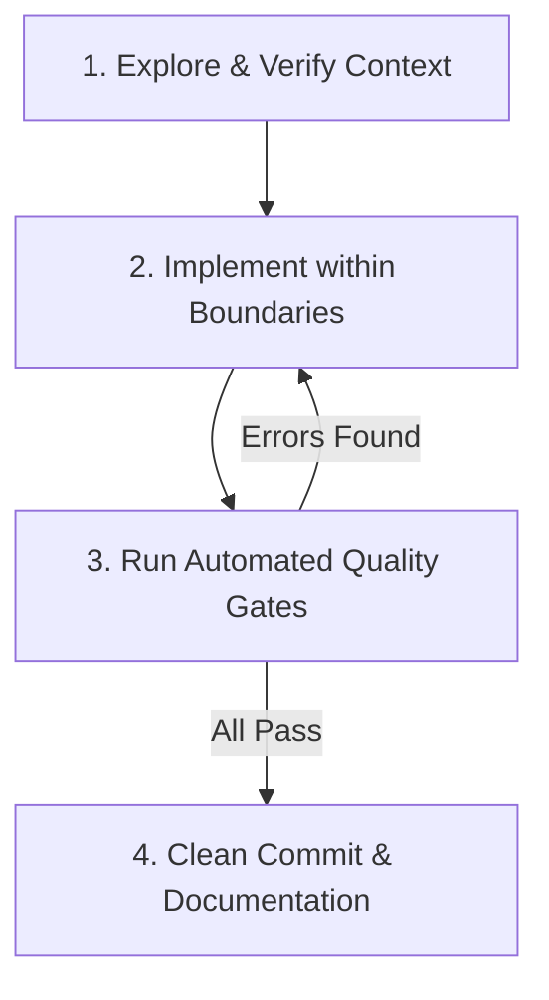

# AURA — Autonomous Agent Development Manual

Welcome to **AURA (Autonomous Real-time Unified Commander)**. This file is the primary operating manual for any autonomous AI agent working in this repository. 

AURA is an enterprise-grade Voice AI Incident Commander embedded as a live voice participant in IT incident war rooms over Agora SD-RTN™ and Conversational AI.

---

## 1. Project Identity & Design Philosophy: "Operational Calm"

AURA is a **NASA mission-control flight deck**, NOT a consumer SaaS app.
- **Visual Theme:** Warm charcoal (`#0C0B0F`), golden amber agent identity (`#D4A853`), semantic status colors.
- **Typography:** IBM Plex Sans (`var(--font-sans)`) for UI text; IBM Plex Mono (`var(--font-mono)`) for timestamps, metrics, code, and logs.
- **Animation Physics:** Motion (`motion/react`) v12.36+ with emotion-specific spring physics from `lib/springs.ts` (urgency vs. relief).
- **Styling Paradigm:** Pure Vanilla CSS with CSS Custom Properties, CSS Container Queries (`container-type: inline-size`), and `color-mix(in oklch, ...)`.
- **The Restraint is the Differentiator:** Every pixel serves an operational purpose. Never add aurora backgrounds, 3D canvas shaders, neon glows, particle effects, or confetti.

---

## 2. Directory Layout & Architecture Map

```
aura/
├── docs/                         # Canonical technical documentation
│   ├── ARCHITECTURE.md           # Master technical architecture, Zod data model, API registry
│   ├── COMPONENTS.md             # Complete reference for all 31 UI components & interfaces
│   ├── DECISIONS.md              # 28 locked architectural decisions (D-001 to D-028)
│   ├── AGORA-API.md              # Agora SDK & REST API quick reference
│   └── TESTING.md                # Automated toolchain & hands-on manual QA guide
├── app/                          # Next.js 16 App Router (Turbopack)
│   ├── api/                      # 18 active Node.js route handlers (`runtime = 'nodejs'`)
│   │   ├── agent/                # /start, /stop, /interrupt, /update
│   │   ├── escalate/             # Manual and auto-escalation trigger
│   │   ├── incident/event/       # Bracket-tag real-time telemetry ingestion
│   │   ├── incidents/            # CRUD, /resolve, /search, /similar
│   │   ├── llm/proxy/            # Custom LLM proxy for Agora ConvAI
│   │   ├── mcp/sse/              # 11 MCP tools over Server-Sent Events
│   │   ├── room/info/            # War room metadata and participants
│   │   ├── token/                # Agora RTC/RTM token generator
│   │   ├── tts/speak/            # Direct TTS broadcast endpoint
│   │   └── tunnel/start/         # Development tunnel helper
│   ├── lobby/                    # Persona selection and pre-flight room setup
│   ├── layout.tsx                # Root layout with IBM Plex fonts
│   └── page.tsx                  # Flight Deck dashboard main page
├── components/                   # 31 production UI components (War Room Flight Deck)
├── hooks/                        # 5 core React hooks
│   ├── useAgoraRTC.ts            # WebRTC microphone capture, audio playback & network quality
│   ├── useAgoraRTM.ts            # Signaling v2.x event bus, transcript & telemetry stream
│   ├── useIncidentState.ts       # Central incident state reducer
│   ├── useCostCounter.ts         # Live $0 Agora free-tier budget tracker
│   └── useVoiceWaveform.ts       # Web Audio API real-time canvas visualizer
├── lib/                          # 13 core engines, types, and utilities
│   ├── types.ts                  # Canonical Zod schemas and TypeScript interfaces
│   ├── db.ts                     # In-memory relational SQLite store pre-seeded with 3 scenarios
│   ├── promptBuilder.ts          # Dynamic ConvAI system prompt builder with scenario injection
│   ├── springs.ts                # Motion spring physics presets
│   ├── scenarios.ts              # Pre-seeded scenario runbooks (payment, CDN, auth)
│   ├── escalationEngine.ts       # Slack webhook & auto-escalation engine
│   ├── rtmPublisher.ts           # Stateless REST publisher for Agora RTM
│   └── similarIncidentAdvisor.ts # Historical incident correlation engine
└── test/                         # 26 Vitest test suites (142 automated tests)
```

---

## 3. Autonomous 4-Step Development Loop

Follow this systematic loop for any coding task:



### Step 1: Explore & Verify Context
- Read target files and existing implementations before modifying them.
- If modifying UI, check [`docs/COMPONENTS.md`](file:///docs/COMPONENTS.md) and [`app/globals.css`](file:///app/globals.css).
- If modifying real-time logic, check [`docs/ARCHITECTURE.md`](file:///docs/ARCHITECTURE.md) and [`docs/DECISIONS.md`](file:///docs/DECISIONS.md).
- Never code from memory.

### Step 2: Implement within Boundaries
- Respect the **Locked Decisions** ([`docs/DECISIONS.md`](file:///docs/DECISIONS.md)):
  - $0 budget: Everything on Agora free tiers.
  - Strict type safety: Use Zod schemas from [`lib/types.ts`](file:///lib/types.ts) — never use `any`.
  - Pure CSS: Use CSS custom properties (`var(--color-*)`) — never add Tailwind.
  - Emotion-specific springs: Import from [`lib/springs.ts`](file:///lib/springs.ts).
- For all `/api/*` routes, ensure `export const runtime = 'nodejs'`.

### Step 3: Run Automated Quality Gates
Before concluding any task, execute the full validation toolchain:

```bash
# 1. Type check
npx tsc --noEmit

# 2. Automated test suite (all 26 files, 142 tests)
npm test

# 3. Linter
npm run lint

# 4. Next.js production build
npm run build
```

Every command must exit with code `0`.

### Step 4: Clean Commit
- Write concise, conventional git commit messages (e.g., `feat(voice): ...`, `fix(rtm): ...`).
- Never leave behind scratch files, temporary logs, or untracked test scripts.

---

## 4. Key Architectural Realities & Gotchas

1. **Dual-Transport Telemetry Protocol:**
   AURA does not rely solely on external MCP SSE tool callbacks. In-stream bracket tags (e.g., `[LOG_FACT: ...]`) emitted during speech are parsed in `<200ms` by [`hooks/useAgoraRTM.ts`](file:///hooks/useAgoraRTM.ts) directly from Deepgram ASR transcripts and background-synced to `/api/incident/event`. This guarantees full local development without open tunnels.

2. **Environment-Adaptive LLM Routing:**
   - On `localhost`, [`app/api/agent/start/route.ts`](file:///app/api/agent/start/route.ts) automatically routes to Agora-managed OpenAI (`gpt-4o-mini`, `credential_mode: 'managed'`).
   - In production, it routes via proxy to `gemini-2.0-flash` (if `GEMINI_API_KEY` exists) or `gpt-4o-mini` (if `OPENAI_API_KEY` exists).

3. **Browser Audio Driver Protection:**
   Chromium on Windows cannot run the Web Speech API and WebRTC microphone capture concurrently without driver starvation. In [`app/page.tsx`](file:///app/page.tsx), Web Speech API is intentionally disabled when the WebRTC bridge is joined (`isJoined === true`).

4. **Agora RTM v2 Singleton & Channel Discipline:**
   - Maintain strict client singleton caching per UID to prevent duplicate client mutual kickoffs (`Ins id is 2`).
   - In RTM 2.x, subscribe with explicit `{ withMessage: true, withPresence: false }` to avoid `-13001 Presence service not connected` errors when the Agora Presence cluster is not enabled.

5. **In-Memory Relational Persistence (`lib/db.ts`):**
   AURA uses an edge-compatible SQL-like in-memory persistence layer storing incidents, evidence items, participants, transcripts, and postmortems pre-seeded with 3 realistic scenarios:
   - `payment-outage` (SEV-1 Payment Gateway Degradation)
   - `cdn-degradation` (SEV-2 Edge CDN Cache Collapse)
   - `auth-breach` (SEV-1 Credential Stuffing & Auth Spike)

---

## 5. Absolute Rules

### ❌ FORBIDDEN
- **NO Tailwind CSS** — Vanilla CSS with custom properties ONLY.
- **NO framer-motion** — Use `motion` from `motion/react` v12.36+.
- **NO Inter, Roboto, or default system fonts** — IBM Plex Sans + IBM Plex Mono ONLY.
- **NO consumer design clichés** — No aurora blobs, glowing borders, particle effects, 3D canvas, confetti.
- **NO `NEXT_PUBLIC_` for secrets** — Agora Customer Keys and Secrets remain strictly server-side in `.env.local`.
- **NO `any` types** — Enforce schemas from `lib/types.ts`.
- **NO paid cloud dependencies** — Zero ElevenLabs, zero paid databases.

### ✅ REQUIRED
- **ALL `/api/*` routes**: `export const runtime = 'nodejs'`.
- **ALL animations**: Use emotion-specific springs from `lib/springs.ts`.
- **ALL colors**: Use CSS custom properties (`var(--color-fact)`).
- **ALL containers**: Apply `container-type: inline-size` for container queries.
- **ALL temporal metrics**: Use `font-variant-numeric: tabular-nums`.
- **Confidence values**: Cap at `Math.min(85, confidence)` — never claim 100% certainty during an active crisis.

---

## 6. Documentation Quick Reference

| Document | Path | Core Information |
|---|---|---|
| Master Architecture | [`docs/ARCHITECTURE.md`](file:///docs/ARCHITECTURE.md) | Zod data models, 18 API routes, 11 MCP tools, dual transport, SQLite DB |
| Component Catalog | [`docs/COMPONENTS.md`](file:///docs/COMPONENTS.md) | 31 UI components, TypeScript props, CSS classes, states |
| Architectural Decisions | [`docs/DECISIONS.md`](file:///docs/DECISIONS.md) | 28 locked decisions (D-001 to D-028) |
| System Prompt & Persona | [`lib/promptBuilder.ts`](file:///lib/promptBuilder.ts) | Executable 17-directive system prompt, dynamic scenario injection, Hinglish rules |
| Agora Technical Reference | [`docs/AGORA-API.md`](file:///docs/AGORA-API.md) | Agora SDK & REST API quick reference |
| Developer Testing & QA | [`docs/TESTING.md`](file:///docs/TESTING.md) | Automated toolchain & hands-on manual QA runbooks |
