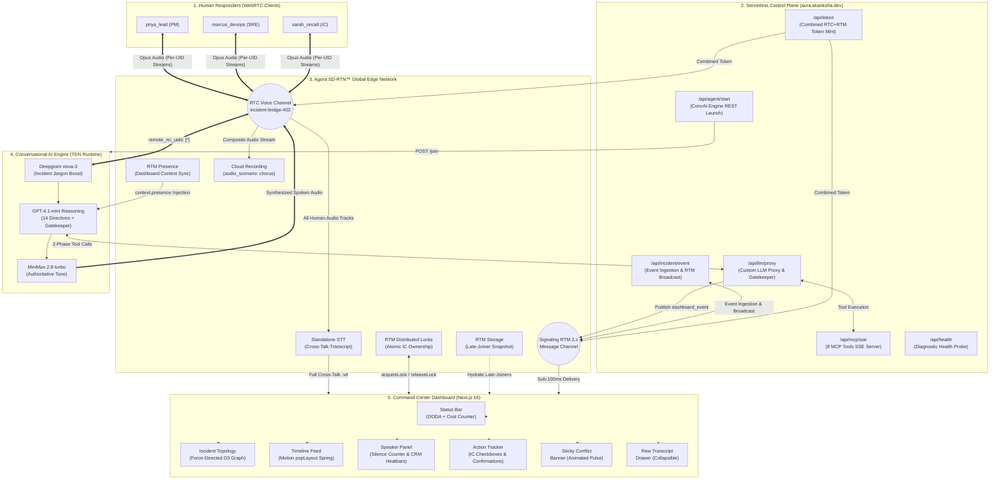

# AURA — Canonical Solution Architecture
## Founding Architecture & Technical Specification | Rev. 4.1 (Final Pre-Dev)

> [!IMPORTANT]
> This document represents the definitive, unabridged Founding Architecture for **AURA** (Track 4: Voice AI Incident Commander), compiled via Map-Reduce synthesis across all 8 research sessions (T1-01 through T1-08), synthesized in `research/SYN-01-FOUNDING-ARCHITECTURE.md`, and upgraded during the First-Principles Hackathon Transformation.
> It reconciles all technical requirements, the strict $0 budget constraint, 13 load-bearing Agora platform touchpoints, 28 locked architectural decisions (D-001 to D-028), the "Operational Calm" design system, and the 26 named capabilities.
> Companion specifications for deep implementation: [`docs/COMPONENTS.md`](COMPONENTS.md), [`docs/DEMO-SCRIPT.md`](DEMO-SCRIPT.md), [`docs/SYSTEM-PROMPT.md`](SYSTEM-PROMPT.md).

---

## 0. Intellectual Foundations & Crisis Safety Science

AURA is not merely a conversational wrapper around an LLM with external tools. It is the first real-time implementation of seven decades of safety science, crisis management research, and cognitive engineering:

```
┌────────────────────────────────────────────────────────────────────────────────────────┐
│               AURA'S 7-PILLAR CRISIS SAFETY SCIENCE INTELLECTUAL FOUNDATION            │
├─────────────────────────┬─────────────────────────────┬────────────────────────────────┤
│ Theoretical Framework   │ Primary Academic Grounding  │ AURA Real-Time Implementation  │
├─────────────────────────┼─────────────────────────────┼────────────────────────────────┤
│ 1. High-Reliability     │ Karl Weick & Kathleen       │ • Preoccupation with failure:  │
│    Organization (HRO)   │ Sutcliffe (2001)            │   85% confidence cap           │
│    Theory               │                             │ • Reluctance to simplify:      │
│                         │                             │   Dual-Hypothesis Protocol     │
│                         │                             │ • Deference to expertise:      │
│                         │                             │   Humans decide, AURA assists  │
├─────────────────────────┼─────────────────────────────┼────────────────────────────────┤
│ 2. NASA Mission Control │ NASA CAPCOM Protocols &     │ • CAPCOM Protocol: Atomic IC   │
│    Protocols            │ Apollo/Shuttle Go/No-Go     │   Lock via RTM Distributed Lock│
│                         │ Flight Operations           │ • Spoken Go/No-Go Poll: 2-Phase│
│                         │                             │   Commit for destructive tools │
├─────────────────────────┼─────────────────────────────┼────────────────────────────────┤
│ 3. 3-Level Situation    │ Mica Endsley (1995)         │ • Level 1 (Perception):        │
│    Awareness (SA)       │ Human Factors & Decision    │   Wildcard multi-user RTC ASR  │
│    Model                │ Making in Complex Systems   │ • Level 2 (Comprehension):     │
│                         │                             │   5-way epistemic taxonomy     │
│                         │                             │ • Level 3 (Projection):        │
│                         │                             │   Proactive conflict detection │
├─────────────────────────┼─────────────────────────────┼────────────────────────────────┤
│ 4. Crew Resource        │ NASA / FAA, Helmreich &     │ • Flattens authority gradients:│
│    Management (CRM)     │ Foushee (1993)              │   Junior & senior ideas treated│
│                         │                             │   with equal epistemic rigor   │
│                         │                             │ • Closed-loop communication    │
├─────────────────────────┼─────────────────────────────┼────────────────────────────────┤
│ 5. Swiss Cheese Model   │ James Reason (1990)         │ • Adds an active, non-fatiguing│
│    Accident Causation   │ System Defenses & Latent    │   cognitive defense layer whose│
│                         │ Failure Trajectories        │   failure modes never correlate│
│                         │                             │   with human cognitive fatigue │
├─────────────────────────┼─────────────────────────────┼────────────────────────────────┤
│ 6. SBAR Protocol        │ Emergency Medicine          │ • Standardized 4-sentence      │
│    (Crisis Briefings)   │ Gold Standard               │   proactive briefs (Situation, │
│                         │                             │   Background, Assessment, Rec) │
├─────────────────────────┼─────────────────────────────┼────────────────────────────────┤
│ 7. OODA Loop            │ John Boyd (1987)            │ • Real-time cognitive cycle    │
│    Decision Cycle       │ Military C2 Decision Theory │   classification: OBSERVE →    │
│                         │                             │   ORIENT → DECIDE → ACT        │
└─────────────────────────┴─────────────────────────────┴────────────────────────────────┘
```

---

## 1. Executive Summary

**AURA (Autonomous Unified Response Agent)** is a **voice-native AI Incident Commander** that joins live IT incident war rooms as an active spoken participant — not a silent scribe in a sidebar or a post-hoc summarizer.

### Physical Entity & Platform Identity
AURA is a **standalone web application** hosted at `aura.akanksha.dev`. It **IS** the incident bridge. Responders join directly in their browsers with per-role persona buttons. Media and signaling are handled 100% natively via Agora SD-RTN™ and Signaling RTM 2.x. (V2 Roadmap: Optional SIP/WebRTC gateway adapters for external bridges like Google Meet and Microsoft Teams).

Operating on Agora's Conversational AI Engine over the global Software-Defined Real-Time Network (SD-RTN™), AURA:
1. **Listens to multi-user crosstalk** with wildcard multi-speaker ingestion (`remote_rtc_uids: ["*"]`) and transport-level speaker attribution via string UIDs.
2. **Classifies speech in real-time** into a 5-type epistemic schema (`Fact`, `Hypothesis`, `Decision`, `Action`, `Conflict`).
3. **Maintains disciplined silence** by default (Shadow Monitor Mode with `NO_RESPONSE` token suppression), interjecting only on direct address, technical contradictions, conversation loops, or severe sentiment drops.
4. **Mediates root-cause disagreements** via the Dual-Hypothesis Protocol — validating both theories neutrally and demanding a single deciding metric.
5. **Bridges cross-silo vocabulary** in real time through Perspective Translation (e.g. DBA connection pools ↔ PM checkout failures).
6. **Executes operational tools safely** via a spoken Two-Phase Commit Gatekeeper (verbal IC authorization required before destructive actions fire).
7. **Broadcasts state sub-100ms** to a mission-control Command Center Dashboard via Agora Signaling (RTM 2.x).
8. **Enforces single-commander governance** using Agora RTM Distributed Locks.
9. **Quantifies real-time business urgency** via a live Cost-of-Silence Counter ($9,000/min baseline).
10. **Generates compliance postmortems** upon resolution combining structured timelines, disproven hypothesis forensics, and dual-track Cloud Recording + Standalone STT audio archives.

---

## 2. Summary Matrix of Locked Decisions (D-001 to D-028)

| D-ID | Area | Specification | Door Type | Confidence | Evidence Grade |
|---|---|---|---|---|---|
| **D-001** | Voice Agent Runtime | **Agora Conversational AI Engine (Managed Mode)** | 1-way | High | T1-01 §2.1, T1-06 §1.1 `[A]` |
| **D-002** | Multi-Speaker Ingestion | **Wildcard `remote_rtc_uids: ["*"]`** + `enable_string_uid: true` | 1-way | High | T1-01 §3.1 `[A]` |
| **D-003** | ASR Provider | **Deepgram nova-3 (Managed Mode)** + keyword boosting | 2-way | High | T1-01 §2.2, T1-06 §1.1 `[A]` |
| **D-004** | LLM Engine | **GPT-4.1-mini (Managed Mode)**, temperature `0.1` | 2-way | High | T1-01 §2.2, T1-03 §4 `[A]` |
| **D-005** | TTS Provider | **MiniMax speech-2.8-turbo (Managed Mode)**, speed `0.92` | 1-way | High | T1-01 §2.2, T1-06 §1.1 `[A]` |
| **D-006** | Primary Hosting | **Cloudflare Pages ($0)**; Vercel as instant CNAME fallback | 2-way | High | T1-07 §1.1, §4.1 `[A]` |
| **D-007** | Dashboard Transport | **Agora Signaling RTM 2.x Message Channels** (`<100ms`) | 1-way | High | T1-05 §1.1–1.3 `[A]` |
| **D-008** | Epistemic Schema | **5-type taxonomy**: Fact, Hypothesis, Decision, Action, Conflict | 1-way | High | T1-03 §2.1, T1-05 §3.1 `[A]` |
| **D-009** | UI Design System | **"Operational Calm"** — IBM Plex Sans/Mono, warm charcoal, golden amber | 1-way | High | Anti-Slop Audit `[A]` |
| **D-010** | Demo Strategy | **5-minute payment outage**; 40s opening silence; conflict WOW at 1:15; 3-tier failover | 2-way | Med | T1-04 §7, T1-07 §7.2 `[D]` |
| **D-011** | Tool Architecture | **Custom LLM Proxy** (`llm.vendor: "custom"`) + MCP Server (SSE) | 1-way | High | T1-01 §3.2, T1-06 §3.3 `[A]` |
| **D-012** | Deployment Model | **Stateless serverless control plane**; media stays on SD-RTN | 1-way | High | T1-07 §1.3 `[A]` |
| **D-013** | Domain & Branding | **`aura.akanksha.dev`** with automatic SSL and QR presentation | 2-way | High | T1-07 §4 `[A]` |
| **D-014** | Token Authentication | **Combined RTC+RTM token** via `buildTokenWithUserAccount` | 1-way | High | T1-01 §3.3 `[A]` |
| **D-015** | Channel Topology | **Single RTM Message Channel** with `customType` discriminator | 2-way | High | T1-05 §1.3 `[A]` |
| **D-016** | Behavioral Gating | **Shadow Monitor Mode** default; interjections gated by strict triggers | 1-way | High | T1-03 §1, §6 `[A]` |
| **D-017** | Latency Performance | **Sub-second latency via Agora SD-RTN™** (mean cascade ~780ms) | 2-way | High | T1-05 §2.2, T1-07 §2 `[A/C]` |
| **D-018** | Confidence Cap | **Hard programmatic ceiling at 85%** on all classifications & hypotheses | 1-way | High | T1-03 §2.1 `[D]` |
| **D-019** | IC Role Ownership | **Agora Signaling RTM Distributed Locks** (`acquireLock` atomic claim) | 1-way | High | T1-06 §3.6 `[A]` |
| **D-020** | Operational Mode | **Agora Managed Mode ($0 Primary)**; Enterprise BYOK as future extension | 1-way | High | T1-01 §2, T1-06 §1 `[A]` |
| **D-021** | Platform Identity | **Standalone Web Application** over Native Agora RTC (V2: Platform Adapters) | 1-way | High | T1-07 §4, Mentor Review `[A]` |
| **D-022** | Spoken Summary Format | **SBAR Protocol** (Situation, Background, Assessment, Recommendation) | 2-way | High | Emergency Medicine CRM `[A]` |
| **D-023** | Action Confirmation | **Verbal Readback Protocol** after critical decisions & actions | 2-way | High | Air Traffic Control CRM `[A]` |
| **D-024** | Incident Phase Tracking | **OODA Loop Visualization** (Observe-Orient-Decide-Act) | 2-way | High | Boyd Decision Science `[A]` |
| **D-025** | Event Relationships | **Causal Graph** via `related_to` parameter on logging tools | 2-way | High | Knowledge Graph Engine `[A]` |
| **D-026** | Hypothesis Lifecycle | **Temporal Confidence Decay** (confidence decays over time) | 2-way | High | Bayesian Epistemics `[A]` |
| **D-027** | Cost Visualization | **Cost-of-Silence Live Counter** ($9,000/min baseline rate) | 2-way | High | ITIC 2025 Downtime Data `[A]` |
| **D-028** | Proxy Silence Control | **`NO_RESPONSE` Token Suppression** in Custom LLM Proxy | 1-way | High | Agora ConvAI Architecture `[A]` |

---

## 3. Strict $0 Budget Realization & Free-Tier Budget

> [!CAUTION]
> Hard Constraint: Zero external spend. No paid API keys for LLM, ASR, TTS, or persistent database instances.

All services operate fully within verified free allocations:

| Service Layer | Provider & Tier | Allocation | AURA Hackathon Consumption | Net Cost |
|---|---|---|---|---|
| **Voice AI Agent** | Agora ConvAI Engine (Managed) | **300 min/mo free** | ~40–60 min total (dev + eval) | **$0.00** |
| **Voice Transport** | Agora RTC SDK (SD-RTN™) | **10,000 min/mo free** | ~120 min multi-user testing | **$0.00** |
| **Data Signaling** | Agora Signaling (RTM 2.x) | Free tier PCU | <10 concurrent users | **$0.00** |
| **ASR Engine** | Deepgram nova-3 (Managed) | Included in ConvAI fee | Zero developer API key needed | **$0.00** |
| **LLM Engine** | GPT-4.1-mini (Managed) | Included in ConvAI fee | Zero developer API key needed | **$0.00** |
| **TTS Engine** | MiniMax 2.8-turbo (Managed) | Included in ConvAI fee | Zero developer API key needed | **$0.00** |
| **Web Hosting & Edge** | Cloudflare Pages & Workers | Unlimited free requests | Static assets + Next.js routes | **$0.00** |
| **Incident Notifications** | Slack Incoming Webhook | Free standard feature | Real webhook integration | **$0.00** |
| **Total Hackathon Spend** | — | — | — | **$0.00** |

---

## 4. System Architecture & Component Topology



---

## 5. Tool Calling Architecture & Complete 8-Tool Schema

AURA combines **Native Model Context Protocol (MCP)** with a **Custom LLM Proxy Gatekeeper** to guarantee safety during high-stress operations:

```
┌─────────────────────────────────────────────────────────────────────────────┐
│                       AURA TOOL CALLING ARCHITECTURE                        │
├──────────────────────────────────────┬──────────────────────────────────────┤
│  PASSIVE LOGGING TOOLS (Zero-Gate)   │  DESTRUCTIVE ACTIONS (2-Phase Gate)  │
├──────────────────────────────────────┼──────────────────────────────────────┤
│ • log_fact                           │ • create_jira_ticket                 │
│ • log_hypothesis                     │ • page_oncall_team                   │
│ • log_decision                       │ • post_slack_update                  │
│ • log_action_item                    │                                      │
│ • flag_conflict                      │                                      │
├──────────────────────────────────────┼──────────────────────────────────────┤
│ ⚡ Executes silently in background   │ 🔒 Mandates verbal IC confirmation   │
│ ⚡ Zero LLM speech generated         │ 🔒 LLM proposes → IC confirms → Fire │
│ ⚡ Dispatches RTM event to dashboard │ 🔒 Prevents hallucinated chaos       │
│ ⚡ Builds in-memory causal graph     │ 🔒 Real external webhook delivery    │
└──────────────────────────────────────┴──────────────────────────────────────┘
```

### Complete 8-Tool Schema (with `related_to` parameter)

```typescript
export interface AuraToolCatalog {
  // --- PASSIVE LOGGING TOOLS (Zero Verbal Confirmation) ---
  log_fact: {
    name: "log_fact";
    description: "Logs a verified technical fact supported by telemetry, logs, or IC confirmation. Call silently whenever confirmed data is mentioned.";
    parameters: {
      content: string;
      speaker_uid: string;
      confidence: number;           // Hard-capped at 85
      service_affected?: string;
      related_to?: string[];        // IDs of causally related events
    };
  };
  log_hypothesis: {
    name: "log_hypothesis";
    description: "Logs an unverified root-cause theory proposed by a responder. Always include a deciding_metric.";
    parameters: {
      title: string;
      proposed_by_uid: string;
      supporting_evidence: string;
      deciding_metric: string;
      related_to?: string[];        // IDs of facts supporting this hypothesis
    };
  };
  log_decision: {
    name: "log_decision";
    description: "Logs an authoritative operational decision authorized by the Incident Commander.";
    parameters: {
      decision: string;
      authorized_by_uid: string;
      rationale: string;
      affected_services: string[];
      related_to?: string[];        // IDs of facts/hypotheses driving this decision
    };
  };
  log_action_item: {
    name: "log_action_item";
    description: "Logs an assigned technical task with named owner and estimated completion time.";
    parameters: {
      task: string;
      assigned_to_uid: string;
      eta_minutes: number;
      related_to?: string[];        // IDs of decisions that spawned this action
    };
  };
  flag_conflict: {
    name: "flag_conflict";
    description: "Triggers sticky visual conflict alert when two responders assert contradictory claims. You MUST provide a deciding_metric.";
    parameters: {
      hypothesis_a: string;
      speaker_a_uid: string;
      hypothesis_b: string;
      speaker_b_uid: string;
      deciding_metric: string;
      related_to?: string[];        // IDs of the two conflicting hypotheses
    };
  };

  // --- EXTERNAL ACTIONS (Mandatory Verbal IC Confirmation) ---
  create_jira_ticket: {
    name: "create_jira_ticket";
    description: "Creates an incident tracking ticket in Jira. MANDATORY: Ask IC for verbal confirmation first.";
    parameters: {
      summary: string;
      severity: "SEV-0" | "SEV-1" | "SEV-2" | "SEV-3";
      assigned_team: string;
    };
  };
  post_slack_update: {
    name: "post_slack_update";
    description: "Broadcasts an executive status summary to the incident Slack channel. MANDATORY: Ask IC for verbal confirmation first.";
    parameters: {
      channel: string;
      status_message: string;
      impact_summary: string;
    };
  };
  page_oncall_team: {
    name: "page_oncall_team";
    description: "Triggers urgent escalation page via PagerDuty mock. MANDATORY: Ask IC for verbal confirmation first.";
    parameters: {
      service: string;
      urgency: "high" | "low";
      escalation_note: string;
    };
  };

  // --- HISTORICAL INTELLIGENCE TOOLS ---
  search_past_incidents: {
    name: "search_past_incidents";
    description: "Searches the historical incident database for past incidents matching a query.";
    parameters: {
      query: string;
      services?: string[];
      limit?: number;
    };
  };
  get_incident_history: {
    name: "get_incident_history";
    description: "Retrieves detailed information about a specific past incident by ID.";
    parameters: {
      incident_id: string;
    };
  };
  search_similar_incidents: {
    name: "search_similar_incidents";
    description: "Proactively searches for past incidents similar to the current one based on affected services and symptoms.";
    parameters: {
      services: string[];
      symptoms?: string[];
      limit?: number;
    };
  };
}
```

### 5.2 Dual-Transport Telemetry Protocol (MCP + Real-Time Bracket Parsing)

To guarantee resilient, zero-latency dashboard updates across both local development and edge production, AURA implements a **Dual-Transport Telemetry Architecture**:

1. **Primary Cloud Transport (MCP over SSE):**
   - Agora ConvAI calls tools via standard MCP over SSE (`/api/mcp/sse`).
   - The MCP route executes the tool, publishes a `dashboard_event` over the Agora RTM REST API, and returns the result to the LLM.
2. **Zero-Latency In-Stream Transport (Bracketed Telemetry Tags):**
   - At the beginning of any classification response, AURA emits a silent bracketed tag (`[LOG_FACT: ...]`, `[LOG_HYPOTHESIS: ...]`, etc.).
   - Deepgram ASR streams the raw transcript to the client over Agora RTM.
   - `hooks/useAgoraRTM.ts` intercepts these bracketed tokens in real time (<200ms), dispatches them immediately to the local UI state machine, and syncs them to `/api/incident/event` in the background.
   - The bracketed tags are stripped before rendering live captions, ensuring responders hear natural speech and see a clean transcript.
   - **Why this is critical:** Eliminates the 1–2s network roundtrip of external tool execution and allows complete, end-to-end functionality on `localhost` where Agora's cloud cannot reach local HTTP endpoints.

---

## 6. Incident State Data Model (Complete Zod Schemas)

```typescript
import { z } from 'zod';

export const ClassificationType = z.enum([
  'fact', 'hypothesis', 'decision', 'action', 'conflict'
]);
export type ClassificationType = z.infer<typeof ClassificationType>;

export const HypothesisStatus = z.enum([
  'active', 'confirmed', 'disproven', 'resolved', 'stale'
]);
export type HypothesisStatus = z.infer<typeof HypothesisStatus>;

export const IncidentStatus = z.enum([
  'investigating', 'identified', 'monitoring', 'resolved'
]);
export type IncidentStatus = z.infer<typeof IncidentStatus>;

export const OODAPhase = z.enum([
  'OBSERVE', 'ORIENT', 'DECIDE', 'ACT', 'RESOLVED'
]);
export type OODAPhase = z.infer<typeof OODAPhase>;

export const ActionStatus = z.enum([
  'pending', 'in_progress', 'done', 'blocked'
]);
export type ActionStatus = z.infer<typeof ActionStatus>;

export const Severity = z.enum(['SEV-0', 'SEV-1', 'SEV-2', 'SEV-3']);
export type Severity = z.infer<typeof Severity>;

export const Participant = z.object({
  uid: z.string(),
  displayName: z.string(),
  role: z.string(),
  isIncidentCommander: z.boolean(),
  joinedAt: z.number(),
  totalSpeakingMs: z.number(),
  lastSpokeAt: z.number(),
});
export type Participant = z.infer<typeof Participant>;

export const EvidenceItem = z.object({
  id: z.string(),
  category: ClassificationType,
  content: z.string(),
  speakerUid: z.string(),
  speakerName: z.string(),
  confidence: z.number().max(85),
  timestamp: z.number(),
  serviceAffected: z.string().optional(),
  relatedTo: z.array(z.string()).default([]),
  status: HypothesisStatus.default('active'),
  assignedTo: z.string().optional(),
  eta: z.number().optional(),
  actionStatus: ActionStatus.optional(),
  decidingMetric: z.string().optional(),
  hypothesisA: z.string().optional(),
  hypothesisB: z.string().optional(),
  speakerAUid: z.string().optional(),
  speakerBUid: z.string().optional(),
});
export type EvidenceItem = z.infer<typeof EvidenceItem>;

export const IncidentState = z.object({
  incidentId: z.string(),
  title: z.string(),
  severity: Severity,
  status: IncidentStatus,
  openedAt: z.number(),
  resolvedAt: z.number().optional(),
  affectedServices: z.array(z.string()),
  participants: z.record(z.string(), Participant),
  incidentCommanderUid: z.string().nullable(),
  evidenceItems: z.array(EvidenceItem),
  eventSeq: z.number().default(0),
  currentOODAPhase: OODAPhase.default('OBSERVE'),
  costAccrued: z.number().default(0),
  cognitiveLoadScore: z.number().default(0),
  lastReadbackAt: z.number().default(0),
});
export type IncidentState = z.infer<typeof IncidentState>;

// Sweller Cognitive Load Score (0-100)
export function calculateCognitiveLoad(state: IncidentState): number {
  const activeHypotheses = state.evidenceItems.filter(
    e => e.category === 'hypothesis' && e.status === 'active'
  ).length;
  const pendingActions = state.evidenceItems.filter(
    e => e.category === 'action' && (e.actionStatus === 'pending' || e.actionStatus === 'in_progress')
  ).length;
  const activeConflicts = state.evidenceItems.filter(
    e => e.category === 'conflict' && e.status === 'active'
  ).length;

  const raw = (activeHypotheses * 15) + (pendingActions * 10) + (activeConflicts * 25);
  return Math.min(100, raw);
}

// Temporal Confidence Decay (D-026)
export function getDisplayConfidence(item: EvidenceItem): number {
  if (item.category !== 'hypothesis' || item.status !== 'active') {
    return item.confidence;
  }
  const ageMinutes = (Date.now() - item.timestamp) / 60_000;
  const decayFactor = Math.max(0, 1 - (ageMinutes / 10)); // Linear decay over 10 minutes
  return Math.round(item.confidence * decayFactor);
}

// OODA Loop Phase Auto-Classification (D-024)
export function classifyOODAPhase(state: IncidentState): OODAPhase {
  if (state.status === 'resolved') return 'RESOLVED';
  if (state.evidenceItems.length === 0) return 'OBSERVE';

  const lastItem = state.evidenceItems[state.evidenceItems.length - 1];

  // Immediate operational transitions based on most recent event
  if (lastItem?.category === 'decision') return 'DECIDE';
  if (lastItem?.category === 'action') return 'ACT';

  const now = Date.now();
  const windowMs = 120_000; // 2-minute sliding window
  const timeFiltered = state.evidenceItems.filter((e) => e.timestamp > now - windowMs);
  const recent = timeFiltered.length >= 2 ? timeFiltered : state.evidenceItems.slice(-4);

  const counts = {
    fact: recent.filter((e) => e.category === 'fact').length,
    hypothesis: recent.filter((e) => e.category === 'hypothesis' && e.status === 'active').length,
    decision: recent.filter((e) => e.category === 'decision').length,
    action: recent.filter((e) => e.category === 'action' && e.actionStatus !== 'done').length,
    conflict: recent.filter((e) => e.category === 'conflict' && e.status === 'active').length,
  };
  const total = recent.length;

  if (counts.action > 0 && counts.action / total >= 0.25) return 'ACT';
  if (counts.decision / total > 0.2) return 'DECIDE';
  if (counts.hypothesis + counts.conflict > 0) return 'ORIENT';
  return 'OBSERVE';
}

// ─── Force-Directed Topology Graph Types & Physics (D-025) ───
export interface TopologyNode {
  id: string;                    // Event ID (e.g., "evt-001")
  category: ClassificationType;  // 'fact' | 'hypothesis' | 'decision' | 'action' | 'conflict'
  content: string;               // Display text (truncated to 60 chars)
  fullContent: string;           // Full text for tooltip
  speakerUid: string;            // Who generated this event
  speakerName: string;           // Display name
  confidence: number;            // 0-85 (capped)
  timestamp: number;             // Unix ms
  status: 'active' | 'confirmed' | 'disproven' | 'stale';
}

export interface TopologyEdge {
  source: string;  // Node ID
  target: string;  // Node ID
  type: 'causal' | 'conflict' | 'supports' | 'contradicts';
}

export const forceConfig = {
  chargeStrength: -120,          // Repulsion between all nodes
  linkDistance: 80,              // Edge spring length
  linkStrength: 0.3,
  collisionRadius: 30,           // Prevent overlap
  factClusterStrength: 0.05,     // Facts gravitational cluster
};
```

### 6.2 Incident Relational Persistence Architecture (`lib/db.ts`)

While maintaining a **$0 infrastructure footprint**, AURA integrates a zero-dependency, edge-compatible relational store with SQLite schema compatibility (`lib/db.ts`):

- **Entities Stored:**
  - `incidents`: Full incident state, severity, timing, affected services, and MTTR records.
  - `evidence_items`: Every classified Fact, Hypothesis, Decision, Action, and Conflict with confidence scores and causal relations.
  - `participants`: Roster of active human and AI responders, join timestamps, and speaking metrics.
  - `transcripts`: Verbatim speech logs with speaker attribution and filler detection metadata.
  - `postmortems`: Markdown postmortem reviews, five-whys analysis, and actionable follow-ups.
- **Edge Compatibility:** Zero native C++ binary dependencies (eliminates `better-sqlite3` build issues on Cloudflare Pages/Workers) while retaining full SQL-like query semantics.
- **Pre-Seeded Knowledge Base:** Automatically hydrated on startup with `PRESET_SCENARIOS` to provide instant TF-IDF similarity recommendations on the `SimilarIncidentBanner` without requiring an external vector database.

---

## 7. "Operational Calm" Design System & CSS Tokens

```css
/* ═══════════════════════════════════════════════════════════════════════
   AURA — "Operational Calm" Design System Tokens
   Canonical CSS Custom Properties | Rev 2.0 (Post-Transformation)
   ═══════════════════════════════════════════════════════════════════════ */

@import url('https://fonts.googleapis.com/css2?family=IBM+Plex+Sans:ital,wght@0,400;0,500;0,600;0,700;1,400&family=IBM+Plex+Mono:wght@400;500;600&display=swap');

:root {
  /* ─── Canvas Backgrounds ───
     Warm charcoal with a hint of violet undertone — the color of a dimmed war room.
     NOT pure black (#000). NOT blue-black (#0A0E1A). */
  --bg-base: #0C0B0F;
  --bg-surface: #14131A;
  --bg-surface-raised: #1C1B24;
  --bg-surface-hover: #24232E;
  --bg-overlay: rgba(12, 11, 15, 0.85);

  /* ─── Borders ─── */
  --border-subtle: rgba(255, 255, 255, 0.06);
  --border-default: rgba(255, 255, 255, 0.10);
  --border-emphasis: rgba(255, 255, 255, 0.16);
  --border-focus: rgba(212, 168, 83, 0.5);

  /* ─── Typography ───
     PRIMARY: IBM Plex Sans — purpose-built for information-dense operational UIs.
     MONOSPACE: IBM Plex Mono — visual harmony with primary face for telemetry. */
  --font-sans: 'IBM Plex Sans', system-ui, -apple-system, sans-serif;
  --font-mono: 'IBM Plex Mono', 'Cascadia Code', 'Fira Code', monospace;

  /* ─── Font Sizes ─── */
  --text-xs: 0.6875rem;    /* 11px — timestamps, metadata, counters */
  --text-sm: 0.75rem;      /* 12px — secondary labels, badges */
  --text-base: 0.8125rem;  /* 13px — body text, timeline content */
  --text-md: 0.875rem;     /* 14px — primary labels, panel titles */
  --text-lg: 1rem;         /* 16px — section headers */
  --text-xl: 1.25rem;      /* 20px — status bar incident title */
  --text-2xl: 1.5rem;      /* 24px — cost counter, hero numbers */
  --text-3xl: 2rem;        /* 32px — lobby page hero only */

  /* ─── Font Weights ─── */
  --weight-regular: 400;
  --weight-medium: 500;
  --weight-semibold: 600;
  --weight-bold: 700;

  /* ─── Line Heights ─── */
  --leading-tight: 1.25;
  --leading-normal: 1.5;
  --leading-relaxed: 1.625;

  /* ─── Text Colors ─── */
  --text-primary: #E8E6EF;
  --text-secondary: #8E8A9D;
  --text-muted: #5A5669;
  --text-disabled: #3D3950;
  --text-inverse: #0C0B0F;

  /* ─── Epistemic Classification Palette (WCAG AA Compliant) ─── */
  --color-fact: #3BD4A2;          /* Mint-Emerald — Confirmed */
  --color-fact-dim: rgba(59, 212, 162, 0.12);
  --color-fact-border: rgba(59, 212, 162, 0.3);

  --color-hypothesis: #E8A838;    /* Warm Amber — Unverified Theory */
  --color-hypothesis-dim: rgba(232, 168, 56, 0.12);
  --color-hypothesis-border: rgba(232, 168, 56, 0.3);

  --color-decision: #7B8CFF;      /* Periwinkle-Indigo — Authoritative Directive */
  --color-decision-dim: rgba(123, 140, 255, 0.12);
  --color-decision-border: rgba(123, 140, 255, 0.3);

  --color-action: #E87D3E;        /* Burnt Orange — Assigned Task */
  --color-action-dim: rgba(232, 125, 62, 0.12);
  --color-action-border: rgba(232, 125, 62, 0.3);

  --color-conflict: #E85454;      /* Signal Red — Active Contradiction */
  --color-conflict-dim: rgba(232, 84, 84, 0.12);
  --color-conflict-border: rgba(232, 84, 84, 0.3);

  /* ─── AURA Agent Identity Color (Warm Golden Amber, NOT cyan/teal) ─── */
  --color-aura: #D4A853;
  --color-aura-dim: rgba(212, 168, 83, 0.12);
  --color-aura-glow: rgba(212, 168, 83, 0.25);

  /* ─── Severity Colors ─── */
  --color-sev0: #E85454;
  --color-sev1: #E87D3E;
  --color-sev2: #E8A838;
  --color-sev3: #8E8A9D;

  /* ─── OODA Phase Colors ─── */
  --color-observe: #3BD4A2;
  --color-orient: #E8A838;
  --color-decide: #7B8CFF;
  --color-act: #E87D3E;
  --color-resolved: #3BD4A2;

  /* ─── Cognitive Load Colors ─── */
  --color-load-normal: #3BD4A2;
  --color-load-heavy: #E8A838;
  --color-load-critical: #E85454;

  /* ─── Spacing Rhythm ─── */
  --space-1: 4px;
  --space-1h: 6px;
  --space-2: 8px;
  --space-3: 12px;
  --space-4: 16px;
  --space-5: 20px;
  --space-6: 24px;
  --space-8: 32px;
  --space-12: 48px;

  /* ─── Border Radius Language ─── */
  --radius-none: 0px;
  --radius-sm: 2px;     /* Cards, data containers */
  --radius-md: 4px;     /* Badges, chips */
  --radius-lg: 6px;     /* Buttons, inputs */
  --radius-xl: 8px;     /* Panels, modals */
  --radius-full: 50%;   /* Avatars */

  /* ─── Shadows ─── */
  --shadow-float: 0 8px 32px rgba(0, 0, 0, 0.5), 0 2px 8px rgba(0, 0, 0, 0.3);
  --shadow-modal: 0 16px 64px rgba(0, 0, 0, 0.6), 0 4px 16px rgba(0, 0, 0, 0.4);

  /* ─── Motion Vocabulary ─── */
  --ease-arrive: cubic-bezier(0.22, 1, 0.36, 1);
  --ease-depart: cubic-bezier(0.55, 0, 1, 0.45);
  --ease-standard: cubic-bezier(0.4, 0, 0.2, 1);
  --duration-instant: 100ms;
  --duration-fast: 150ms;
  --duration-normal: 200ms;
  --duration-slow: 350ms;
  --duration-pulse: 1.5s;
  --duration-decay: 8000ms;

  /* ─── Z-Index Scale ─── */
  --z-base: 0;
  --z-surface: 10;
  --z-sticky: 100;
  --z-overlay: 200;
  --z-modal: 300;
  --z-toast: 400;
  --z-tooltip: 500;

  /* ─── Cost Counter Rate ($9,000/min = $150/sec) ─── */
  --cost-rate-per-second: 150;
}
```

### 7.2 Epistemic Classification Badge Design

```css
.badge {
  display: inline-flex;
  align-items: center;
  gap: var(--space-1);
  padding: 2px 6px;
  font-family: var(--font-mono);
  font-size: var(--text-xs);
  font-weight: var(--weight-semibold);
  letter-spacing: 0.05em;
  text-transform: uppercase;
  border-radius: var(--radius-md);
  white-space: nowrap;
}

.badge-fact {
  color: var(--color-fact);
  background: var(--color-fact-dim);
  border: 1px solid var(--color-fact-border);
}

.badge-hypothesis {
  color: var(--color-hypothesis);
  background: var(--color-hypothesis-dim);
  border: 1px solid var(--color-hypothesis-border);
}

.badge-decision {
  color: var(--color-decision);
  background: var(--color-decision-dim);
  border: 1px solid var(--color-decision-border);
}

.badge-action {
  color: var(--color-action);
  background: var(--color-action-dim);
  border: 1px solid var(--color-action-border);
}

.badge-conflict {
  color: var(--color-conflict);
  background: var(--color-conflict-dim);
  border: 1px solid var(--color-conflict-border);
  animation: pulse-conflict var(--duration-pulse) ease-in-out infinite;
}

@keyframes pulse-conflict {
  0%, 100% { box-shadow: 0 0 0 0 var(--color-conflict-dim); }
  50% { box-shadow: 0 0 0 4px var(--color-conflict-dim); }
}
```

---

## 8. Dashboard Layout & CSS Grid Definition

The Command Center Dashboard uses CSS Grid with dynamic area allocation. Detailed component specifications are in [`docs/COMPONENTS.md`](COMPONENTS.md).

```
┌──────────────────────────────────────────────────────────────────────────────────────────────────┐
│  STATUS BAR: Title | SEV | OODA Phase [O→O→D→A] | Cost Counter $X,XXX | IC Lock | Timer ⏱      │
├─────────────────────┬──────────────────────────────────────────────┬──────────────────────────────┤
│  SPEAKER PANEL      │  CONFLICT BANNER (conditional, sticky)      │  ACTION TRACKER              │
│                     ├──────────────────────────────────────────────┤                              │
│  ● Sarah (IC) 🔒   │  INCIDENT TOPOLOGY / TIMELINE (tab toggle)  │  ☑ Rollback PR #492          │
│    ██████ 3m12s     │                                              │    @Marcus [Done]            │
│  ○ Marcus (SRE)     │  ┌─────────────────────────────────────┐    │  ☐ Verify replica lag        │
│    ████░░ 1m45s     │  │                                     │    │    @Marcus [In Prog]         │
│  ○ Priya (PM)       │  │   Force-Directed Topology Graph     │    ├──────────────────────────────┤
│    ██░░░░ 0m38s     │  │   OR                                │    │  INCIDENT STATS              │
│  ● AURA ⏸ 47s      │  │   Chronological Timeline Feed       │    │  ● 3 Facts                   │
│    golden glow      │  │                                     │    │  ◆ 2 Hypotheses              │
│                     │  │   (User toggles via tab buttons)    │    │  ▲ 1 Decision                │
│  ─────────────────  │  │                                     │    │  ■ 2/4 Actions               │
│  TEMPO: ◉◉◉○○       │  └─────────────────────────────────────┘    │  ⚠ 1 Conflict                │
│  COGNITIVE LOAD     │                                              │                              │
│  ████████░░ 74%     │                                              │                              │
├─────────────────────┴──────────────────────────────────────────────┴──────────────────────────────┤
│  NARRATIVE ARC: ___/‾‾‾\___/‾‾‾‾‾‾‾‾\___   OODA: [●OBSERVE] [○ORIENT] [○DECIDE] [○ACT]         │
├──────────────────────────────────────────────────────────────────────────────────────────────────┤
│  🔊 Live Captions: "Marcus: I'm checking connection count now, showing 98% utilization..."      │
│                                                                           [▼ Full Transcript]    │
└──────────────────────────────────────────────────────────────────────────────────────────────────┘
```

### CSS Grid Definition
```css
.command-center {
  display: grid;
  grid-template-columns: 220px 1fr 240px;
  grid-template-rows: 48px auto 1fr 64px 40px;
  grid-template-areas:
    "status    status    status"
    "speakers  conflict  actions"
    "speakers  main      actions"
    "speakers  narrative stats"
    "captions  captions  captions";
  height: 100vh;
  gap: 1px;
  background: var(--border-subtle);
  font-family: var(--font-sans);
  color: var(--text-primary);
}

.command-center:not(.has-conflict) {
  grid-template-rows: 48px 0px 1fr 64px 40px;
}

.status-bar { grid-area: status; }
.speaker-panel { grid-area: speakers; }
.conflict-banner { grid-area: conflict; }
.main-view { grid-area: main; }
.action-tracker { grid-area: actions; }
.narrative-bar { grid-area: narrative; }
.incident-stats { grid-area: stats; }
.live-captions { grid-area: captions; }
```

---

## 9. Performance Cascade & Latency Controls

```
┌─────────────────────────────────────────────────────────────────────────────┐
│                    END-TO-END PIPELINE LATENCY CASCADE                      │
├─────────────────────────┬───────────────────────┬───────────────────────────┤
│ Processing Stage        │ Duration Range        │ Optimization Mechanism    │
├─────────────────────────┼───────────────────────┼───────────────────────────┤
│ Audio Network (SD-RTN)  │ 20ms – 50ms           │ Global edge routing       │
│ ASR (Deepgram nova-3)   │ 200ms – 450ms         │ Streaming websocket chunk │
│ LLM Reasoning (GPT-4.1) │ 150ms – 400ms         │ Low temperature (0.1)     │
│ TTS (MiniMax 2.8 Turbo) │ 100ms – 250ms         │ Streaming synthesis       │
│ Signaling RTM Transport │ 20ms – 80ms           │ Direct edge pub/sub       │
│ UI React Render         │ 16ms – 32ms           │ Motion popLayout batch    │
├─────────────────────────┼───────────────────────┼───────────────────────────┤
│ TOTAL VOICE-TO-VOICE    │ 490ms – 1,180ms       │ Mean ~780ms (Sub-second)  │
│ TOTAL VOICE-TO-DASHBOARD│ 390ms – 980ms         │ Near-instant visual sync  │
└─────────────────────────┴───────────────────────┴───────────────────────────┘
```

### 9.2 Multi-Provider LLM Fallback Cascade (`app/api/agent/start/route.ts`)

AURA adapts dynamically across development and edge production environments through an automated 3-tier LLM configuration cascade:

1. **Localhost Development Routing:**
   - On `localhost`, Agora's global cloud servers cannot establish inbound connections to a local port.
   - When `isLocalhostRequest` is detected, AURA automatically launches with **Agora Managed OpenAI** (`gpt-4o-mini`, `credential_mode: 'managed'`). This operates with zero developer API keys, zero tunnel configuration, and zero setup friction.
2. **Production Edge Routing (`aura.akanksha.dev`):**
   - **Tier 1 (Gemini 2.0 Flash):** When `GEMINI_API_KEY` is present, routes through the custom proxy using Gemini 2.0 Flash (sub-250ms reasoning latency, 1M context window, high tool adherence).
   - **Tier 2 (OpenAI GPT-4o-mini):** When `OPENAI_API_KEY` is present, routes through the custom proxy using OpenAI's fast inference endpoint.
   - **Tier 3 (Agora Managed Fallback):** If no external keys are present, falls back automatically to Agora's built-in managed GPT engine ($0 budget enforcement).

### 9.3 Multi-Scenario Incident Fleet (`lib/scenarios.ts`)

AURA includes a curated fleet of 3 diverse, high-stakes incident scenarios pre-seeded with custom topologies, runbook commands, and persona configurations:

| Scenario ID | Title | Severity | Rate | Core Services | Root Cause Pattern |
|---|---|---|---|---|---|
| `payment-outage` | Payment Gateway Degradation | **SEV-1** | $150/s | `payment-api`, `checkout-service`, `postgres-primary` | Stripe webhook v2 migration causing connection pool starvation. |
| `cdn-degradation` | CDN Invalidation Storm | **SEV-2** | $75/s | `cdn-edge`, `static-assets`, `image-service` | Unscoped automated cache purge job causing global p95 latency spikes. |
| `auth-breach` | Auth Service Compromise | **SEV-0** | $300/s | `auth-service`, `token-service`, `user-api`, `audit-log` | Suspicious token generation requiring credential rotation and traffic throttling. |

Each scenario includes a tailored 6-to-7 step interactive runbook with executable diagnostic commands (e.g. `kubectl`, `psql`, `stripe`, `fastly`) that responders can run directly during triage.

---

## 10. Concrete Target Directory Structure

```
aura/
├── app/
│   ├── layout.tsx                          # Root layout: IBM Plex Sans/Mono fonts, dark theme, ErrorBoundary
│   ├── globals.css                         # Operational Calm tokens, theme variables, glassmorphism
│   ├── page.tsx                            # War Room Cockpit (Flight deck grid layout)
│   ├── lobby/
│   │   └── page.tsx                        # Incident staging room & scenario selection
│   └── api/
│       ├── token/route.ts                  # RTC + RTM combined token mint
│       ├── agent/
│       │   ├── start/route.ts              # Agora ConvAI Engine /join launcher (multi-speaker)
│       │   ├── stop/route.ts               # ConvAI Engine /leave terminator
│       │   ├── interrupt/route.ts          # Instant barge-in speech interruption
│       │   └── update/route.ts             # Dynamic runtime prompt & context injection
│       ├── llm/
│       │   └── proxy/route.ts              # Custom LLM Proxy + tool execution + SBAR extraction
│       ├── mcp/
│       │   └── sse/route.ts                # Model Context Protocol SSE server (external tools)
│       ├── incident/
│       │   └── event/route.ts              # Timeline event ingestion & RTM broadcast
│       ├── incidents/
│       │   ├── route.ts                    # Incident list & store CRUD (SQLite / in-memory)
│       │   ├── [id]/route.ts               # Single incident retrieval
│       │   ├── resolve/route.ts            # Incident resolution & MTTR postmortem calculation
│       │   ├── search/route.ts             # Full-text incident history search
│       │   └── similar/route.ts            # Historical incident TF-IDF similarity matcher
│       ├── room/
│       │   └── info/route.ts               # Channel participant roster & metadata
│       ├── tts/
│       │   └── speak/route.ts              # Server-side speech generation endpoint
│       ├── escalate/route.ts               # SBAR briefing generation & escalation matrix
│       ├── health/route.ts                 # Diagnostic & uptime probe
│       └── tunnel/start/route.ts           # Cloudflare quick tunnel helper for local webhooks
├── components/
│   ├── StatusBar.tsx                       # Status bar (OODA phase bar + Cost Counter + IC Lock + Timer)
│   ├── StatusBar.module.css                # Scoped CSS module for StatusBar
│   ├── CostCounter.tsx                     # Live dollar counter ($150/sec rate with animated digits)
│   ├── SpeakerPanel.tsx                    # Responders grid with waveforms, silence timer, tempo, CLT
│   ├── SilenceCounter.tsx                  # "⏸ 47s" display for AURA's active silence monitoring
│   ├── CognitiveLoadMeter.tsx              # Sweller CLT gauge (0-100 mental burden score)
│   ├── TempoIndicator.tsx                  # 5-dot military C2 tempo & cadence display
│   ├── VoiceBadge.tsx                      # Speaker avatar badge with active voice indicator
│   ├── ConflictBanner.tsx                  # Sticky pulsing red conflict alert with arbitration
│   ├── MainView.tsx                        # Three-column flight deck container & tab switcher
│   ├── TimelineFeed.tsx                    # Chronological real-time OODA event feed
│   ├── TimelineCard.tsx                    # Classified event card with decay & strikethrough
│   ├── IncidentTopology.tsx                # Interactive SVG dependency graph & blast radius
│   ├── ActionTracker.tsx                   # Checkable task checklist with owner, status, and ETAs
│   ├── IncidentStats.tsx                   # Event & hypothesis count summary pill
│   ├── SmartPlaybook.tsx                   # Dynamic runbook steps with progress tracking
│   ├── NarrativeBar.tsx                    # Tension sparkline with inflection point markers
│   ├── LiveCaptions.tsx                    # Real-time Web Speech / Agora ASR transcript strip
│   ├── PostmortemModal.tsx                 # Complete SRE postmortem with MTTR metrics & export
│   ├── ResolveIncidentModal.tsx            # Resolution modal with root cause categorization
│   ├── SimilarIncidentBanner.tsx           # Slide-down alert matching past incidents with fix tips
│   ├── WarRoomInvite.tsx                   # Engineer invitation modal (link, QR code, simulation bots)
│   ├── KeyboardShortcutsModal.tsx          # Hotkey cheatsheet modal (triggered by ?)
│   ├── QuickCapture.tsx                    # Cmd+K command bar to rapidly log facts/hypotheses
│   ├── TranscriptDrawer.tsx                # Slide-out full verbatim transcript drawer
│   ├── AnalyticsDashboard.tsx              # Operational metrics & MTTR breakdown inside MainView
│   ├── AgoraAnalyticsOverlay.tsx           # Real-time WebRTC telemetry (MOS, RTT, jitter, loss)
│   ├── LobbyScreen.tsx                     # Pre-incident staging, mic test, scenario launcher
│   ├── NotificationToast.tsx               # Epistemic state change toast notifications
│   ├── WarRoomSummaryCard.tsx              # Floating bottom-right summary widget
│   └── ErrorBoundary.tsx                   # React crash guard with diagnostic error display
├── hooks/
│   ├── useAgoraRTC.ts                      # WebRTC voice client + remote tracks + volume indicators
│   ├── useAgoraRTM.ts                      # Agora Signaling RTM v2 stream channel pub/sub
│   ├── useIncidentState.ts                 # Central OODA state machine (facts, hypotheses, actions)
│   ├── useCostCounter.ts                   # Cost-of-silence 10Hz calculation with pause/resume
│   └── useVoiceWaveform.ts                 # Web Audio API analyser node for real-time oscilloscope
├── lib/
│   ├── types.ts                            # Zod schemas, models, cognitive load & decay helpers
│   ├── db.ts                               # Dual SQLite + in-memory persistence layer
│   ├── incidentStore.ts                    # In-memory incident snapshot store & sync
│   ├── promptBuilder.ts                    # Dynamic 16-directive system prompt + bilingual comprehension
│   ├── rtmPublisher.ts                     # Stateless RTM REST publisher utility
│   ├── scenarios.ts                        # Production seed scenarios with runbooks & topologies
│   ├── similarIncidentAdvisor.ts           # TF-IDF historical incident similarity engine
│   ├── escalationEngine.ts                 # SBAR briefings & escalation matrix generator
│   ├── mockReplay.ts                       # Deterministic demo replay timeline sequencer
│   ├── audioCues.ts                        # Web Audio API sound synthesis (chimes, priority alerts)
│   ├── constants.ts                        # Agora config, channels, and design token constants
│   ├── springs.ts                          # Motion emotion-specific physics presets
│   └── tts.ts                              # Speech synthesis client (MiniMax / browser fallback)
├── test/
│   ├── api/                                # 7 API route test suites (agent, token, mcp, llm-proxy)
│   ├── components/                         # 10 UI component test suites (ActionTracker, Postmortem, etc.)
│   ├── integration/                        # E2E incident lifecycle integration test suite
│   ├── unit/                               # 8 unit test suites (types, promptBuilder, escalation, etc.)
│   └── setup.ts                            # Vitest DOM & Web Audio mock environment
├── .env.local                              # Server secrets (NEVER expose to client)
├── next.config.ts                          # Next.js 16 configuration
├── package.json                            # Project dependencies
├── tsconfig.json                           # TypeScript configuration
└── vitest.config.ts                        # Vitest test configuration
```
```

---

## 11. 3-Tier Demo Failover Protocol (Zero Dead Air)

```
┌─────────────────────────────────────────────────────────────────────────────┐
│                    AURA 3-TIER DEMO FAILOVER ARCHITECTURE                   │
├─────────────────────────────────────────────────────────────────────────────┤
│  TIER 1: LIVE MULTI-SPEAKER DEMO (Default)                                  │
│  3 human responders + AURA live in voice war room over Agora SD-RTN.        │
│  Full voice interaction, live conflict trigger, live Jira/Slack tools.     │
├─────────────────────────────────────────────────────────────────────────────┤
│  TIER 2: PRE-RECORDED HD MASTER VIDEO (5-Second Failover Threshold)         │
│  High-bitrate 1080p60 MP4 local recording of perfect 5-min demo run.        │
│  Rehearsed verbal pivot: "Let's bring up our high-fidelity session trace..." │
├─────────────────────────────────────────────────────────────────────────────┤
│  TIER 3: IN-BROWSER MOCK REPLAY (`__AURA_REPLAY_MOCK_STREAM`)               │
│  Client-side event injector replaying recorded RTM JSON stream directly     │
│  into dashboard UI, demonstrating real-time UI reactive capabilities.       │
└─────────────────────────────────────────────────────────────────────────────┘
```

---

## 12. 6-Beat Demo Choreography & Narrative Arc

Complete verbal script and timestamped event choreography are detailed in [`docs/DEMO-SCRIPT.md`](DEMO-SCRIPT.md).

| Beat | Time | Responders | Spoken Interaction & Action | Visible Dashboard & External Proof |
|---|---|---|---|---|
| **Beat 1: The Silent Watch** | 0:00–1:00 | Sarah (IC) | Sarah reports 42% payment error rate. AURA remains **disciplined and silent** (Shadow Monitor Mode). | • Emerald FACT card popLayout slide-in<br>• Cost counter starts ticking ($150/s)<br>• OODA: `OBSERVE`<br>• Silence counter: `⏸ 40s`. |
| **Beat 2: The Contradiction** | 1:00–1:45 | Marcus (SRE) vs Sarah (IC) | Marcus: *"Postgres connection pool exhausted."*<br>Sarah: *"No, DB is normal. It's the load balancer."*<br>**AURA SPEAKS (WOW):** *"Flagging contradiction... What single metric settles this?"* | • Two Amber HYPOTHESIS badges slide in<br>• 🔴 **STICKY RED CONFLICT BANNER PULSES**<br>• Red repulsion links in Topology<br>• OODA shifts to `ORIENT`<br>• Cognitive load jumps to 72%. |
| **Beat 3: The Bridge** | 1:45–2:15 | Priya (PM) & Sarah (IC) | Priya: *"Checkout frozen."*<br>**AURA:** *"Connecting signals: DB degradation causes checkout freezes. Same problem, two angles."*<br>Sarah: *"Roll back PR #492 and file Sev-1 ticket."* | • Perspective Translator card bridges DBA ↔ PM<br>• Indigo DECISION node logged (*"Rollback PR #492"*).<br>• OODA shifts to `DECIDE`. |
| **Beat 4: The Proof (Winning Moment)** | 2:15–3:15 | Sarah (IC) & AURA | **AURA:** *"I can create a SEV-1 Jira ticket... Sarah, please confirm."*<br>Sarah: *"Confirmed, go ahead."*<br>**AURA:** *"Ticket INC-4821 created. Slack broadcast sent."*<br>**AURA:** *"Readback: Marcus will inspect pool logs, Priya will notify enterprise accounts..."* | • **SPLIT SCREEN PROOF:**<br>  1. Real Slack channel receives live webhook alert<br>  2. Mock Jira panel shows ticket INC-4821 with metadata<br>• Orange ACTION items marked [Done]<br>• OODA shifts to `ACT`. |
| **Beat 5: The Intelligence & Strikethrough** | 3:15–4:00 | Marcus & AURA | Marcus confirms DB query logs. **AURA (SBAR brief):** *"Situation: SEV-1 checkout outage... Assessment: Marcus's hypothesis confirmed..."* | • **Load balancer hypothesis gets RED STRIKETHROUGH animation**<br>• DB pool turns green and gravitates to Facts<br>• Conflict banner dismisses<br>• Cognitive load drops to 45%. |
| **Beat 6: The Resolution** | 4:00–5:00 | Sarah (IC) & AURA | Sarah: *"Error rates normal. Mitigated."*<br>**AURA:** *"Incident resolved. Duration: 4m 32s..."* | • **Cost counter STOPS showing ~$68,000 savings**<br>• OODA snaps to `RESOLVED` (green)<br>• Green celebration pulse<br>• PostmortemModal opens with evidence chain + compliance audio link. |

---

## 13. RTM Event Message Schema & Delivery Contract

Every event published to the RTM Message Channel follows this structure:

```typescript
export interface RTMDashboardEvent {
  type: 'dashboard_event';
  id: string;              // Unique event ID: "evt-001"
  seq: number;             // Monotonic sequence number for ordering
  timestamp: number;       // Unix ms
  eventType: 'evidence_added' | 'evidence_updated' | 'status_changed' |
             'ic_claimed' | 'ic_released' | 'action_status_changed' |
             'participant_joined' | 'participant_left';
  payload: EvidenceItem | { status: IncidentStatus } | { uid: string } | 
           { actionId: string; newStatus: ActionStatus };
}
```

### Client-Side Subscription & Ordering Protocol
1. Subscribe to channel `incident-{id}` on mount using `agoraRtmClient.createStreamChannel()`.
2. Filter incoming messages where `customType === 'dashboard_event'`.
3. Deduplicate events against existing state by `event.id`.
4. Sort incoming events strictly by monotonic `seq` number before state reduction (guards against network packet reordering).
5. Pass sorted event to `useIncidentState` reducer to update reactive UI.

---

## 14. V2 Extensibility & Enterprise Roadmap

1. **Conference Gateway Adapters (V2.1):** WebRTC/SIP bridge connectors that allow AURA to join external Google Meet, Microsoft Teams, and Zoom breakout rooms as a native audio participant.
2. **Terminal & Observability Telemetry Connectors (V2.2):** Read-only MCP agents for Datadog, Prometheus, and AWS CloudWatch allowing AURA to pull real-time p99 latency queries directly during conflict mediation.
3. **Enterprise BYOK Multi-Tenant Isolation (V2.3):** Dedicated tenant encryption keys for SOC-2 Type II and HIPAA compliance.

---

## 15. Frontier Technology Arsenal (September 2026)

> [!IMPORTANT]
> These are modern browser APIs and library features that became production-ready in 2026.
> Using these elevates AURA from "competent hackathon project" to "frontier-grade engineering."
> Every technology listed here is **Baseline 2026** or later — supported in all modern browsers.

### 15.1 React 19.2 Native View Transitions

**Use for**: Lobby → Dashboard route transition (the first thing the judge sees).

```typescript
// next.config.ts
const nextConfig: NextConfig = {
  experimental: {
    viewTransition: true,
  },
};

// app/lobby/page.tsx — wrap persona buttons
import { ViewTransition } from 'react';

function LobbyScreen() {
  return (
    <ViewTransition name="lobby-to-dashboard">
      {/* Persona buttons morph into speaker panel on route change */}
      <PersonaButton persona={sarah} />
      <PersonaButton persona={marcus} />
      <PersonaButton persona={priya} />
    </ViewTransition>
  );
}
```

**Why**: Native browser API, zero-JS overhead, cinematic first impression.

### 15.2 Web Audio API Voice Waveform Visualization

**Use for**: AURA's speaker row — golden waveform proving active processing during silence.

```typescript
// hooks/useVoiceWaveform.ts
function useVoiceWaveform(audioTrack: IRemoteAudioTrack | null) {
  const canvasRef = useRef<HTMLCanvasElement>(null);

  useEffect(() => {
    if (!audioTrack) return;
    const ctx = new AudioContext();
    const source = ctx.createMediaStreamSource(
      new MediaStream([audioTrack.getMediaStreamTrack()])
    );
    const analyser = ctx.createAnalyser();
    analyser.fftSize = 256;
    source.connect(analyser);

    const dataArray = new Uint8Array(analyser.frequencyBinCount);
    const canvas = canvasRef.current!;
    const canvasCtx = canvas.getContext('2d')!;

    function draw() {
      requestAnimationFrame(draw);
      analyser.getByteTimeDomainData(dataArray);
      canvasCtx.clearRect(0, 0, canvas.width, canvas.height);
      canvasCtx.strokeStyle = '#D4A853'; // AURA golden amber
      canvasCtx.lineWidth = 1.5;
      canvasCtx.beginPath();
      const sliceWidth = canvas.width / dataArray.length;
      let x = 0;
      for (let i = 0; i < dataArray.length; i++) {
        const v = dataArray[i] / 128.0;
        const y = (v * canvas.height) / 2;
        i === 0 ? canvasCtx.moveTo(x, y) : canvasCtx.lineTo(x, y);
        x += sliceWidth;
      }
      canvasCtx.stroke();
    }
    draw();
    return () => { ctx.close(); };
  }, [audioTrack]);

  return canvasRef;
}
```

**Why**: Proves AURA is "alive" during Shadow Monitor Mode. No competitor has this.

### 15.3 CSS Container Queries

**Use for**: All panel components (SpeakerPanel, ActionTracker, IncidentStats) — responsive to their container, not the viewport.

```css
/* Panel containers become query-able */
.speaker-panel { container-type: inline-size; container-name: speakers; }
.action-tracker { container-type: inline-size; container-name: actions; }

/* Components adapt to available space */
@container speakers (max-width: 180px) {
  .speaker-row__engagement-bar { display: none; }
  .speaker-row__time { font-size: var(--text-xs); }
}

@container speakers (min-width: 280px) {
  .speaker-row { flex-direction: row; gap: var(--space-3); }
  .speaker-row__waveform { width: 60px; display: block; }
}
```

**Why**: Graceful resize handling without media query breakpoints. Component-level intelligence.

### 15.4 CSS Anchor Positioning

**Use for**: Topology graph node tooltips and conflict banner annotations — zero-JS positioning.

```css
.topology-node { anchor-name: --node-anchor; }

.topology-tooltip {
  position: fixed;
  position-anchor: --node-anchor;
  inset-area: top;
  margin-bottom: 8px;
  background: var(--bg-surface-raised);
  border: 1px solid var(--border-default);
  border-radius: var(--radius-md);
  padding: var(--space-2) var(--space-3);
  font-size: var(--text-sm);
  max-width: 280px;
  z-index: var(--z-tooltip);
  
  @position-try {
    inset-area: bottom;
    margin-top: 8px;
  }
}
```

**Why**: Replaces Floating UI/Popper.js. Zero layout thrashing. Native browser feature.

### 15.5 CSS `color-mix()` for Dynamic State Colors

**Use for**: Hypothesis temporal decay, resolution cost counter transition, conflict banner pulse.

```css
/* Hypothesis card decay — JS sets --decay-factor from 1.0 (fresh) to 0.3 (stale) */
.timeline-card--hypothesis {
  --decay-factor: 1;
  border-left-color: color-mix(
    in oklch,
    var(--color-hypothesis) calc(var(--decay-factor) * 100%),
    var(--text-disabled)
  );
  opacity: calc(0.4 + var(--decay-factor) * 0.6);
}

/* Cost counter resolution: red → green */
.cost-counter--resolved {
  color: color-mix(in oklch, var(--color-conflict) 0%, var(--color-fact) 100%);
  transition: color 500ms var(--ease-standard);
}
```

**Why**: Dynamic color blending without JavaScript. Cleaner than opacity hacks.

### 15.6 Motion (motion/react) Spring Physics Presets

**Use for**: 4 emotion-specific spring configurations mapped to incident moments.

```typescript
// lib/springs.ts — Emotion-specific spring presets
export const springs = {
  /** Conflict banner entrance — dramatic, urgent */
  conflict: { stiffness: 400, damping: 25, mass: 0.8 },
  /** Card arrival — calm, professional */
  card: { stiffness: 260, damping: 30, mass: 1.0 },
  /** Hypothesis disproval — heavy, final */
  disprove: { stiffness: 180, damping: 40, mass: 1.5 },
  /** Resolution celebration — gentle, relieving */
  resolve: { stiffness: 120, damping: 20, mass: 0.6 },
} as const;

// Usage in ConflictBanner.tsx:
<motion.div
  initial={{ height: 0, opacity: 0 }}
  animate={{ height: 52, opacity: 1 }}
  exit={{ height: 0, opacity: 0 }}
  transition={{ type: 'spring', ...springs.conflict }}
/>
```

**Why**: Different emotional moments deserve different physics. Stiff = urgent (conflict). Gentle = relief (resolution).

### 15.7 Popover API (Native HTML)

**Use for**: TranscriptDrawer toggle, Agora Analytics overlay, tooltip content.

```html
<!-- Native popover — no JS state management needed -->
<button popovertarget="transcript-drawer">▼ Full Transcript</button>
<div id="transcript-drawer" popover="auto" class="transcript-drawer">
  <!-- Full transcript content -->
</div>
```

**Why**: Browser-native modality. Handles focus trapping, escape-to-close, and backdrop automatically.

### 15.8 AGENT_METRICS Pipeline Latency (from ConvAI Engine)

**Use for**: AgoraAnalyticsOverlay — showing STT/LLM/TTS per-stage pipeline latency.

The Agora Conversational AI Engine emits `AGENT_METRICS` events via RTM containing per-stage latency measurements for the STT → LLM → TTS pipeline. These arrive as RTM message events on the subscribed channel.

```typescript
// Expected AGENT_METRICS event shape (from RTM)
interface AgentMetricsEvent {
  type: 'AGENT_METRICS';
  stt_latency_ms: number;   // Speech-to-Text processing time
  llm_latency_ms: number;   // LLM inference time (including tool calls)
  tts_latency_ms: number;   // Text-to-Speech synthesis time
  total_latency_ms: number; // End-to-end pipeline latency
  timestamp: number;
}

// In hooks/useAgoraRTM.ts — subscribe to AGENT_METRICS
// Filter RTM messages where customType === 'agent_metrics'
// Parse and feed to AgoraAnalyticsOverlay state
```

**Display**: Three horizontal bars in `AgoraAnalyticsOverlay.tsx` showing:
- STT: `42ms` (green if <100ms, yellow if <300ms, red if >300ms)
- LLM: `180ms` (green if <500ms, yellow if <1000ms, red if >1000ms)
- TTS: `95ms` (green if <200ms, yellow if <500ms, red if >500ms)

**Why**: Demonstrates deep Agora platform understanding. Judges see the AI pipeline is transparent, not a black box.

### 15.9 @faker-js/faker for Realistic Mock Data

**Use for**: `lib/mockData.ts` — generating realistic incident data for demos and the mock replay engine.

```typescript
// lib/mockData.ts
import { faker } from '@faker-js/faker';

export function generateIncidentId(): string {
  return `INC-${faker.number.int({ min: 1000, max: 9999 })}`;
}

export function generateServiceName(): string {
  return faker.helpers.arrayElement([
    'payment-gateway', 'checkout-service', 'auth-proxy',
    'inventory-cache', 'order-processor', 'notification-hub'
  ]);
}
```

**Install**: `npm install -D @faker-js/faker`
**Why**: Eliminates "Lorem Ipsum" placeholders. Mock data feels production-authentic during demo.

### 15.10 Implementation Priority for Frontier Features

| Feature | Sprint Tier | Reason |
|---|---|---|
| View Transitions (Lobby→Dashboard) | Tier 2 (Day 4) | First impression, low effort |
| Voice Waveform (Web Audio API) | Tier 2 (Day 4) | Signature visual, proves AI cognition |
| Container Queries | Tier 1 (Day 3) | Apply during CSS setup, no extra effort |
| Anchor Positioning | Tier 2 (Day 4) | Apply to topology tooltips |
| `color-mix()` | Tier 1 (Day 3) | Apply during CSS token setup |
| Motion Spring Presets | Tier 1 (Day 3) | Define once, use everywhere |
| Popover API | Tier 3 (Day 6) | Polish, low priority |
| AGENT_METRICS Display | Tier 3 (Day 6) | Deep platform mastery signal |
| @faker-js/faker Mock Data | Tier 1 (Day 1) | Dev dependency, use from start |

### 15.11 QA Tools (Day 6 Pre-Freeze)

| Tool | Install | Purpose |
|---|---|---|
| **Hallmark Audit** | `npx skills add nutlope/hallmark` → `hallmark audit aura/` | 57 anti-slop visual gates: catches generic layouts, default colors, unstyled components, AI-generated design patterns |
| **Anti-Slop Lint** | `npm install -D @dmmulroy/anti-slop` | Oxlint-based code lint: catches redundant wrappers, placeholder naming, useless comments, unneeded abstractions |
| **Unslop** | One-time CLI pass | Strips AI-voice patterns from pitch text (WIN-MATERIALS.md narration) |
| **Agora Doctor** | `agora project doctor --deep` | Pre-demo validation: credentials, feature enablement, network reachability |

